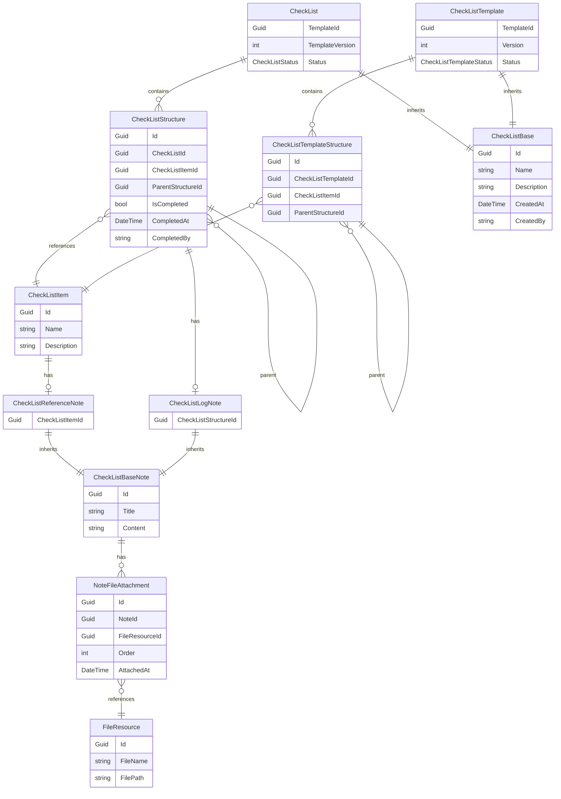

# Listory エンティティ設計書

## 概要

本ドキュメントは、チェックリストアプリケーション **Listory** のエンティティ設計をまとめたものです。
アプリ全体の設計ではなく、**データモデル層（Domain / Core Models）** のみを対象としています。

## 設計方針

- 設計対象は `namespace Listory.Core.Models` に属するエンティティ。
- C# におけるモダンなエンティティ設計パターンを採用。
- 無段階（任意深さ）階層構造を持つチェックリストをサポート。
- 双方向ナビゲーション（Parent / Child）を維持しつつ、DB整合性を重視。
- FileResource は参照元を持たず、一方向参照のみ。
- CheckList と CheckListTemplate を分離し、テンプレートのバージョン管理をサポート。
- 抽象基底クラスを活用して共通機能を整理。

## エンティティ構造概要（Mermaid）

## エンティティ詳細

### 🧩 CheckListBase（抽象クラス）

CheckList と CheckListTemplate の共通基底クラス。

| プロパティ | 型 | 説明 |
|-------------|----|------|
| Id | Guid | 一意識別子 |
| Name | string | チェックリスト名 |
| Description | string | チェックリストの説明 |
| CreatedAt | DateTime? | 作成日 |
| CreatedBy | string? | 作成者 |

### 📋 CheckList

チェックリスト全体を表すルートエンティティ。CheckListBase を継承。

| プロパティ | 型 | 説明 |
|-------------|----|------|
| TemplateId | Guid | テンプレートの一意識別子 |
| TemplateVersion | int | テンプレートのバージョン |
| Status | CheckListStatus | チェックリストの状態 |
| Structures | ICollection\<CheckListStructure\> | チェックリストの構成要素 |

#### CheckListStatus（Enum）

- Active: アクティブ
- Archived: アーカイブ済み
- Deleted: 削除済み

### 📝 CheckListTemplate

チェックリストのテンプレート。CheckListBase を継承。

| プロパティ | 型 | 説明 |
|-------------|----|------|
| TemplateId | Guid | テンプレートの一意識別子（全バージョンで共通） |
| Version | int | テンプレートのバージョン |
| Status | CheckListTemplateStatus | テンプレートのステータス |
| Structures | ICollection\<CheckListTemplateStructure\> | テンプレートの構成要素 |

#### CheckListTemplateStatus（Enum）

- Active: アクティブ
- Editing: 編集中
- Archived: アーカイブ済み
- Deleted: 削除済み

### 🧱 CheckListStructure

チェックリストの構成情報を表す。

| プロパティ | 型 | 説明 |
|-------------|----|------|
| Id | Guid | 一意識別子 |
| CheckListId | Guid | 所属するチェックリストID |
| CheckList | CheckList | チェックリストへの参照 |
| CheckListItemId | Guid | チェック項目ID |
| CheckListItem | CheckListItem | チェック項目への参照 |
| ParentStructureId | Guid? | 親ノードのID（ルートの場合はnull） |
| ParentStructure | CheckListStructure? | 親構成への参照 |
| ChildStructures | ICollection\<CheckListStructure\> | 子構成リスト |
| LogNote | CheckListLogNote? | 記録情報（未記録の場合はnull） |
| IsCompleted | bool | チェック完了状態 |
| CompletedAt | DateTime? | 完了日時 |
| CompletedBy | string? | 完了者 |

#### CheckListStructureの特徴

- **Parent / Child 両方の参照**を保持
- **チェック状態 + 記録情報** を統合的に管理
- **CompletedAt / CompletedBy** により履歴的な情報を保持

### 🧱 CheckListTemplateStructure

チェックリストテンプレートの構成情報を表す。

| プロパティ | 型 | 説明 |
|-------------|----|------|
| Id | Guid | 一意識別子 |
| CheckListTemplateId | Guid | 所属するチェックリストテンプレートID |
| CheckListTemplate | CheckListTemplate | チェックリストテンプレートへの参照 |
| CheckListItemId | Guid | チェック項目ID |
| CheckListItem | CheckListItem | チェック項目への参照 |
| ParentStructureId | Guid? | 親ノードのID（ルートの場合はnull） |
| ParentStructure | CheckListTemplateStructure? | 親構成への参照 |
| ChildStructures | ICollection\<CheckListTemplateStructure\> | 子構成リスト |

#### CheckListTemplateStructureの特徴

- **Parent / Child 両方の参照**を保持
- **チェック状態は持たない**（テンプレートの定義のみ）
- CheckListから実際の作業を作成する際の雛形となる

### 🧾 CheckListItem

チェック項目定義。

| プロパティ | 型 | 説明 |
|-------------|----|------|
| Id | Guid | 一意識別子 |
| Name | string | 項目名 |
| Description | string | 項目の説明 |
| ReferenceNote | CheckListReferenceNote? | リファレンスノート |

### 🗒️ CheckListBaseNote（抽象クラス）

CheckListReferenceNote と CheckListLogNote の共通基底クラス。

| プロパティ | 型 | 説明 |
|-------------|----|------|
| Id | Guid | 一意識別子 |
| Title | string | タイトル |
| Content | string | コンテンツ |
| FileAttachments | ICollection\<NoteFileAttachment\> | 添付ファイルリスト |

### 📄 CheckListReferenceNote

チェック項目に対する参照情報（手順書的な補足）。CheckListBaseNote を継承。

| プロパティ | 型 | 説明 |
|-------------|----|------|
| CheckListItemId | Guid | チェック項目ID |
| CheckListItem | CheckListItem | チェック項目への参照 |

- チェック項目作成時に登録する参照情報（手順書的な補足・注意事項など）
- `CheckListItem` に属する。

### 📝 CheckListLogNote

チェック実行時のログ情報。CheckListBaseNote を継承。

| プロパティ | 型 | 説明 |
|-------------|----|------|
| CheckListStructureId | Guid | チェックリスト構成ID |
| CheckListStructure | CheckListStructure | チェックリスト構成への参照 |

- チェック実施時に記録されるログ情報（メモ・備考など）
- `CheckListStructure` に属する。

### 📎 FileResource

ファイルリソース情報。

| プロパティ | 型 | 説明 |
|-------------|----|------|
| Id | Guid | 一意識別子 |
| FileName | string | ファイル名 |
| FilePath | string | ファイルパス |

#### FileResourceの特徴

- **中立的なリソース**として設計され、どのエンティティが使用しているかは持たない。
- `NoteFileAttachment` を介して `CheckListBaseNote` から参照される。
- 将来的に外部ストレージ（Blob / S3 など）への移行を想定。

### 🔗 NoteFileAttachment

ノートとファイルリソースの中間テーブル。

| プロパティ | 型 | 説明 |
|-------------|----|------|
| Id | Guid | 一意識別子 |
| NoteId | Guid | ノートID |
| Note | CheckListBaseNote | ノートへの参照 |
| FileResourceId | Guid | ファイルリソースID |
| FileResource | FileResource | ファイルリソースへの参照 |
| Order | int | ファイルの表示順序 |
| AttachedAt | DateTime | ファイルが添付された日時 |

#### NoteFileAttachmentの特徴

- ノートとファイルの多対多関係を実現
- 表示順序と添付日時を管理

## 設計上の考慮点

| 項目 | 内容 |
|------|------|
| **階層構造** | `ParentStructure` と `ChildStructures` の両方を保持。 |
| **参照方向** | FileResource は一方向参照のみ。循環参照を避ける。 |
| **削除ポリシー** | 子要素を自動削除しない（OnDelete.Restrict 推奨）。 |
| **履歴情報** | 完了者・完了日時を記録し、操作トレーサビリティを確保。 |
| **UI拡張性** | ツリー表示・展開／収束表示など、再帰的UI描画を想定。 |
| **テンプレート管理** | CheckList と CheckListTemplate を分離し、バージョン管理を可能に。 |
| **構造の分離** | CheckListStructure と CheckListTemplateStructure を分離し、テンプレート定義と作業進捗を明確に区別。 |
| **抽象化** | CheckListBase と CheckListBaseNote で共通機能を整理。 |
| **ファイル管理** | NoteFileAttachment を使用して、ノートとファイルの多対多関係を実現。 |

## 🧭 まとめ

- CheckList と CheckListTemplate を分離し、テンプレートのバージョン管理をサポート。
- CheckListBase と CheckListBaseNote という抽象基底クラスを導入し、共通機能を整理。
- CheckListStructure と CheckListTemplateStructure を分離し、テンプレート定義と実際の作業を明確に区別。
- CheckListTemplateStructure はチェック状態を持たず、テンプレートの階層構造定義のみを担当。
- CheckListStructure はチェック状態を持ち、実際の作業の進捗管理を担当。
- FileResource は「誰が参照しているか」を持たず、中立的リソースとして扱う。
- NoteFileAttachment を使用して、ノートとファイルの多対多関係を実現し、表示順序と添付日時を管理。
- CheckListStructure と CheckListTemplateStructure は無段階ツリー構造を完全サポートするため、Parent と Child 両方を保持。
- IsCompleted / CompletedAt / CompletedBy により、簡潔かつ履歴可能なチェック状態を実現。
- 全エンティティはシンプルな1対多・1対1の関係を維持し、再利用性を重視。
