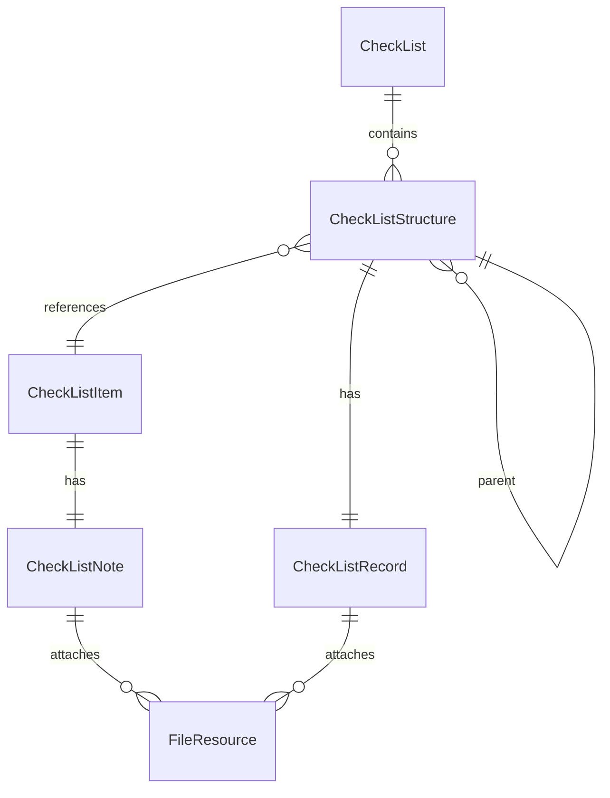

# Listory エンティティ設計書

## 概要

本ドキュメントは、チェックリストアプリケーション **Listory** のエンティティ設計をまとめたものです。  
アプリ全体の設計ではなく、**データモデル層（Domain / Core Models）** のみを対象としています。

---

## 設計方針

- 設計対象は `namespace Listory.Core.Models` に属するエンティティ。  
- C# におけるモダンなエンティティ設計パターンを採用。  
- 無段階（任意深さ）階層構造を持つチェックリストをサポート。  
- 双方向ナビゲーション（Parent / Child）を維持しつつ、DB整合性を重視。
- FileResource は参照元を持たず、一方向参照のみ。

---

## エンティティ構造概要（Mermaid）

---

## エンティティ詳細

### 🧩 CheckList

| プロパティ | 型 | 説明 |
|-------------|----|------|
| Id | Guid | 一意識別子 |
| Name | string | チェックリスト名 |
| Description | string | チェックリストの説明 |
| Structures | ICollection<CheckListStructure> | チェックリストの構成要素 |

---

### 🧱 CheckListStructure

| プロパティ | 型 | 説明 |
|-------------|----|------|
| Id | Guid | 一意識別子 |
| CheckListId | Guid | 所属するチェックリストID |
| CheckList | CheckList | チェックリストへの参照 |
| CheckListItemId | Guid | 紐づくチェック項目のID |
| CheckListItem | CheckListItem | チェック項目への参照 |
| ParentStructureId | Guid? | 親ノードのID（ルートの場合はnull） |
| ParentStructure | CheckListStructure? | 親構成への参照 |
| ChildStructures | ICollection<CheckListStructure> | 子構成リスト |
| Record | CheckListRecord | 実行時の記録情報 |
| IsChecked | bool | チェック完了状態 |
| CompletedAt | DateTime? | 完了日時 |
| CompletedBy | string? | 完了者 |

#### CheckListStructureの特徴

- **Parent / Child 両方の参照**を保持
- **チェック状態 + 記録情報** を統合的に管理
- **CompletedAt / CompletedBy** により履歴的な情報を保持

---

### 🧾 CheckListItem

| プロパティ | 型 | 説明 |
|-------------|----|------|
| Id | Guid | 一意識別子 |
| Name | string | 項目名 |
| Description | string? | 項目説明 |
| Note | CheckListNote? | 定義時の補足情報 |

---

### 🗒️ CheckListNote / CheckListRecord

#### 共通構造（抽象概念）

| プロパティ | 型 | 説明 |
|-------------|----|------|
| Id | Guid | 一意識別子 |
| Title | string? | タイトル |
| Content | string? | 内容 |
| Files | ICollection<FileResource> | 添付ファイル群 |

#### CheckListNote

- チェック項目作成時に登録する補足情報（説明・注意事項など）
- `CheckListItem` に属する。

#### CheckListRecord

- チェック実施時に記録される情報（メモ・備考など）
- `CheckListStructure` に属する。

---

### 📎 FileResource

| プロパティ | 型 | 説明 |
|-------------|----|------|
| Id | Guid | 一意識別子 |
| FileName | string | ファイル名 |
| FilePath | string | 保存パス |
| ContentType | string? | MIMEタイプ |

#### FileResourceの特徴

- **中立的なリソース**として設計され、どのエンティティが使用しているかは持たない。
- `CheckListNote` または `CheckListRecord` からのみ参照される。
- 将来的に外部ストレージ（Blob / S3 など）への移行を想定。

---

## 設計上の考慮点

| 項目 | 内容 |
|------|------|
| **階層構造** | `ParentStructure` と `ChildStructures` の両方を保持。 |
| **参照方向** | FileResource は一方向参照のみ。循環参照を避ける。 |
| **削除ポリシー** | 子要素を自動削除しない（OnDelete.Restrict 推奨）。 |
| **履歴情報** | 完了者・完了日時を記録し、操作トレーサビリティを確保。 |
| **UI拡張性** | ツリー表示・展開／収束表示など、再帰的UI描画を想定。 |

---

## 🧭 まとめ

- FileResource は「誰が参照しているか」を持たず、中立的リソースとして扱う。  
- CheckListStructure は無段階ツリー構造を完全サポートするため、Parent と Child 両方を保持。  
- IsChecked / CompletedAt / CompletedBy により、簡潔かつ履歴可能なチェック状態を実現。  
- 全エンティティはシンプルな1対多・1対1の関係を維持し、再利用性を重視。
